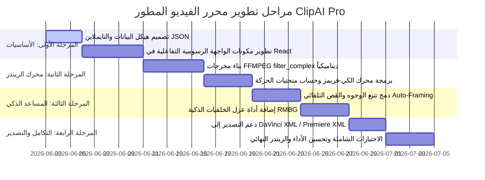

# 🎬 وثيقة التصميم الفني والخطة التنفيذية الكاملة لتطوير محرر الفيديو الاحترافي المزدوج (AI + Manual) لبرنامج ClipAI Studio

توضح هذه الوثيقة التفصيلية خطة هندسية متكاملة لتحويل تطبيق **ClipAI** من أداة قص تلقائية قائمة على الذكاء الاصطناعي فحسب، إلى محطة عمل رقمية لتحرير الفيديو (Non-Linear Editor - NLE) شبيهة ببرامج **Adobe Premiere Pro** و **DaVinci Resolve** و **CapCut Desktop**، مع دمج الذكاء الاصطناعي كمساعد نشط (AI Co-pilot) يتحكم ويوصي ويحرر في نفس بيئة العمل والجدول الزمني (Timeline) الموحد.

---

## 🏛️ القسم الأول: الرؤية العامة وبنية النظام الهجينة (Hybrid System Architecture)

تعتمد البنية المقترحة على فصل واجهة العرض الرسومية والتفاعل اللحظي عن محرك الريندر والتحليل الثقيل، مع توفير بروتوكول تواصل فائق السرعة عبر خادم FastAPI محلي وتطبيق Tauri كغلاف لسطح المكتب.

```mermaid
graph TD
    subgraph Frontend (React + TS + Canvas)
        TimelineUI[مكون الجدول الزمني المتعدد المسارات Multi-track Timeline]
        PreviewPlayer[مشغل المعاينة اللحظي Canvas Preview WebCodecs]
        InspectorPanel[لوحة الخصائص والتعديل Inspector Panel]
        AiCoPilot[مساعد الذكاء الاصطناعي النشط AI Co-pilot Chat & Assist]
    end

    subgraph Backend (FastAPI + Python + C++ Utilities)
        API[نهايات الاتصال البرمجية FastAPI endpoints]
        TimelineParser[محلل الجدول الزمني Timeline JSON Parser]
        RenderEngine[محرك ريندر FFMPEG complex_filter Generator]
        LocalAI[حزمة الذكاء الاصطناعي المحلي Local AI Pipelines]
        FaceTracker[متتبع الوجوه البصري Face Tracker & Auto-Frame]
        BgRemoval[إزالة الخلفيات الذكي Background Remover RMBG/SAM]
    end

    TimelineUI -->|JSON Sync| API
    API --> TimelineParser
    TimelineParser --> RenderEngine
    LocalAI --> FaceTracker
    LocalAI --> BgRemoval
    PreviewPlayer <-->|WebSocket Stream/Frames| API
```

### 1.1 فلسفة عمل المحرر الهجين (The Hybrid Editing Philosophy)
* **المسار اليدوي (Manual Path):** يمتلك المستخدم تحكماً كاملاً في إضافة المسارات (فيديو، صوت، ترجمة، تأثيرات، B-roll)، وقص الكليبات (Split/Trim)، وتعديل الألوان والتباين، وإضافة الفلاتر، وتطبيق الكي-فريمز (Keyframes) لتحريك العناصر.
* **المسار الذكي (AI Path):** يعمل الذكاء الاصطناعي في نفس بيئة العمل. عند طلب المستخدم "قص الصمت" أو "أضف B-rolls مناسبة" أو "تتبع وجه المتحدث"، لا يقوم الذكاء الاصطناعي بتصدير فيديو نهائي مغلق، بل يقوم **بتعديلโครงสร้าง الجدول الزمني (Timeline JSON)** أمام المستخدم كأن محررًا بشريًا قام بوضع الكليبات، مما يسمح للمستخدم بتعديل أو حذف أو نقل ما فعله الـ AI يدوياً بكل حرية.

---

## 2️⃣ القسم الثاني: هيكل البيانات الموحد للجدول الزمني (Unified Timeline JSON Schema)

الهيكل البرمجي المركزي هو كائن JSON يمثل حالة المشروع بدقة (Timeline State). تتم مزامنته لحظياً بين واجهة React وخادم FastAPI.

```json
{
  "project_id": "proj_99812",
  "project_name": "My Epic Short",
  "settings": {
    "width": 1080,
    "height": 1920,
    "fps": 30,
    "sample_rate": 44100,
    "aspect_ratio": "9:16"
  },
  "tracks": {
    "video": [
      {
        "id": "v_track_1",
        "name": "Main Speaker Video",
        "index": 0,
        "clips": [
          {
            "id": "clip_v1",
            "source_path": "C:/Users/husso/Desktop/videos/interview.mp4",
            "start_time_in_timeline": 0.0,
            "end_time_in_timeline": 15.2,
            "source_trim_start": 2.5,
            "source_trim_end": 17.7,
            "speed": 1.0,
            "volume": 1.0,
            "transform": {
              "position": { "x": 0, "y": 0 },
              "scale": { "x": 100, "y": 100 },
              "rotation": 0,
              "keyframes": [
                { "time": 0.0, "property": "scale", "value": { "x": 100, "y": 100 }, "easing": "ease-in-out" },
                { "time": 5.0, "property": "scale", "value": { "x": 130, "y": 130 }, "easing": "ease-out" }
              ]
            },
            "color_grading": {
              "brightness": 0.05,
              "contrast": 1.1,
              "saturation": 1.2,
              "temperature": 5600,
              "lut_path": ""
            },
            "filters": [
              { "type": "blur", "params": { "radius": 5 } },
              { "type": "vignette", "params": { "intensity": 0.4 } }
            ],
            "ai_features": {
              "face_tracking": true,
              "bg_removed": false,
              "bg_remove_method": "chromakey",
              "chromakey_color": "#00FF00"
            }
          }
        ]
      }
    ],
    "audio": [
      {
        "id": "a_track_1",
        "name": "Background Music",
        "index": 0,
        "clips": [
          {
            "id": "clip_a1",
            "source_path": "C:/Users/husso/Desktop/music/epic_beats.wav",
            "start_time_in_timeline": 0.0,
            "end_time_in_timeline": 15.2,
            "source_trim_start": 0.0,
            "source_trim_end": 15.2,
            "volume": 0.15,
            "fade_in": 1.0,
            "fade_out": 2.0,
            "effects": [
              { "type": "compressor", "params": { "threshold": -20, "ratio": 4 } },
              { "type": "ducking", "params": { "target_track": "v_track_1", "attenuation_db": -12 } }
            ]
          }
        ]
      }
    ],
    "subtitles": [
      {
        "id": "sub_track_1",
        "clips": [
          {
            "id": "sub_1",
            "text": "مرحباً بكم في الحلقة الجديدة من البودكاست!",
            "start_time": 0.0,
            "end_time": 3.2,
            "style": {
              "font_name": "Cairo-Bold",
              "font_size": 48,
              "primary_color": "#FFFFFF",
              "stroke_color": "#000000",
              "stroke_width": 2,
              "animation": "pop_in",
              "alignment": "center_bottom"
            }
          }
        ]
      }
    ],
    "overlays": [
      {
        "id": "overlay_track_1",
        "clips": [
          {
            "id": "overlay_clip_1",
            "type": "broll",
            "source_path": "C:/Users/husso/Desktop/broll/crypto_chart.mp4",
            "start_time_in_timeline": 4.0,
            "end_time_in_timeline": 8.0,
            "source_trim_start": 0.0,
            "source_trim_end": 4.0,
            "transform": {
              "position": { "x": 0, "y": 0 },
              "scale": { "x": 100, "y": 100 }
            }
          }
        ]
      }
    ]
  }
}
```

---

## 3️⃣ القسم الثالث: الملفات وهيكل المجلدات الجديد (New Project Layout)

لتحويل النظام إلى بنية NLE، سيتم إعادة تنظيم الملفات وتعديل الملفات الحالية كالتالي:

```text
clipai/
│
├── api.py                    <-- تعديل: نهايات اتصال لمزامنة الجدول الزمني والريندر والذكاء الاصطناعي
├── orchestrator.py           <-- تعديل: إدارة سير العمل وتحويل الـ JSON إلى عمليات معالجة
├── editor.py                 <-- تعديل وتطوير: محرك المونتاج الأساسي المعتمد على FFMPEG
├── manual_trimmer.py         <-- تعديل: أدوات القص والتقطيع اللحظية
├── app_constants.py          <-- تعديل: ثوابت الفلاتر والتصاميم والإعدادات
├── resolve_exporter.py       <-- تعديل: تصدير التايملاين إلى DaVinci Resolve (FCPL XML)
│
├── ai_director.py            <-- تعديل: الإخراج التلقائي وتدفقات المساعد الذكي
├── ai_engine.py              <-- تعديل: استدعاء نماذج الذكاء الاصطناعي المحلية وتحليل المشاهد
│
├── bg_remover.py             <-- [جديد] كلاسات إزالة الخلفية محلياً (RMBG / Green Screen)
├── keyframe_engine.py        <-- [جديد] محرك حساب مسارات التحريك والانتربولاشن الرياضي
├── tracker.py                <-- [جديد] كود تتبع الأجسام وحركة الوجوه لتنفيذ Auto-Reframing
│
└── web/
    └── src/
        ├── App.tsx           <-- تعديل: دمج التايم لاين الجديد مع اللوحات الفرعية
        ├── index.css         <-- تعديل: إضافة تصميم لوحات المونتاج الاحترافية
        ├── components/
        │   ├── Timeline/     <-- [جديد] مجلد مكونات التايملاين
        │   │   ├── Timeline.tsx
        │   │   ├── TrackHeader.tsx
        │   │   ├── TrackLane.tsx
        │   │   ├── ClipItem.tsx
        │   │   └── Playhead.tsx
        │   ├── Inspector/    <-- [جديد] لوحة تحكم خصائص الكليب المحدد
        │   │   ├── TransformPanel.tsx
        │   │   ├── ColorGradingPanel.tsx
        │   │   ├── KeyframeController.tsx
        │   │   └── FiltersPanel.tsx
        │   ├── Panels/       <-- [جديد] اللوحات الأخرى
        │   │   ├── MediaPool.tsx
        │   │   ├── AiCoPilotPanel.tsx
        │   │   └── SubtitleEditor.tsx
        │   └── Player/       <-- [جديد] مشغل المعاينة الذكي
        │       └── CanvasPreview.tsx
```

---

## 4️⃣ القسم الرابع: تنفيذ الواجهة الرسومية التفاعلية (Frontend NLE UI Components)

تصميم لوحات المونتاج بلغة CSS مخصصة بالكامل (Dark Glassmorphism) لتحقيق مظهر وملمس متميز وخاطف للأنظار.

### 4.1 واجهة المستخدم الرئيسية ([App.tsx](file:///c:/Users/husso/Desktop/clibbing/clipai/web/src/App.tsx))
تعديل واجهة البرنامج لتقسيم الشاشة إلى 3 أقسام رئيسية:
1. **القسم الأيسر العلوي:** لوحة الوسائط (Media Pool) ومساعد الذكاء الاصطناعي (AI Co-pilot).
2. **القسم الأيمن العلوي:** مشغل المعاينة (Canvas Preview) بجانبه لوحة الخصائص (Inspector Panel).
3. **القسم السفلي:** الجدول الزمني المتعدد المسارات (Multi-track Timeline) مع أزرار التحكم بالتشغيل وقص الفيديو.

### 4.2 مكون الجدول الزمني الفاخر ([Timeline.tsx](file:///c:/Users/husso/Desktop/clibbing/clipai/web/src/components/Timeline/Timeline.tsx))
مكون تفاعلي مطور يدعم:
* **التكبير والتصغير (Zoom In/Out):** تغيير المقياس الزمني بالثانية والبكسل.
* **السحب والإفلات (Drag and Drop):** سحب الكليبات بين المسارات وتغيير موضعها الزمني.
* **تعديل الأطراف (Trimming):** سحب حواف الكليب لزيادة أو تقليل طوله.
* **القص (Splitting):** تقسيم الكليب النشط عند موضع مؤشر القراءة (Playhead) بضغطة زر (مثلاً اختصار حرف C أو زر القص).

```typescript
// هيكل مقترح لمكون الجدول الزمني التفاعلي
import React, { useRef, useState } from 'react';
import { TimelineState, Clip } from '../../types';
import TrackLane from './TrackLane';
import Playhead from './Playhead';

interface TimelineProps {
  state: TimelineState;
  onChange: (newState: TimelineState) => void;
  currentTime: number;
  setCurrentTime: (time: number) => void;
}

export const Timeline: React.FC<TimelineProps> = ({ state, onChange, currentTime, setCurrentTime }) => {
  const [zoomLevel, setZoomLevel] = useState<number>(10); // pixels per second
  const timelineRef = useRef<HTMLDivElement>(null);

  const handleSplit = () => {
    // خوارزمية تقسيم الكليب المحدد عند currentTime
    const updatedTracks = { ...state.tracks };
    // البحث عن الكليب الذي يقع فيه الـ playhead حالياً وتقسيمه لكليبين
    onChange({ ...state, tracks: updatedTracks });
  };

  return (
    <div className="flex flex-col h-96 bg-gray-950 border-t border-gray-800 text-gray-200 select-none">
      {/* شريط الأدوات العلوي للتايملاين */}
      <div className="flex items-center justify-between p-2 bg-gray-900 border-b border-gray-800">
        <div className="flex items-center gap-2">
          <button onClick={handleSplit} className="px-3 py-1 bg-red-600 hover:bg-red-700 rounded text-xs flex items-center gap-1 transition">
            ✂️ Split (C)
          </button>
          <button className="px-3 py-1 bg-gray-800 hover:bg-gray-700 rounded text-xs transition">
            🔗 Link Clips
          </button>
        </div>
        <div className="flex items-center gap-4">
          <span className="text-xs text-gray-400">Zoom:</span>
          <input 
            type="range" 
            min="1" 
            max="100" 
            value={zoomLevel} 
            onChange={(e) => setZoomLevel(Number(e.target.value))} 
            className="w-32 accent-purple-600"
          />
        </div>
      </div>

      {/* مسارات الجدول الزمني */}
      <div ref={timelineRef} className="flex-1 overflow-y-auto overflow-x-auto relative min-h-0">
        <Playhead currentTime={currentTime} zoomLevel={zoomLevel} timelineRef={timelineRef} onChangeTime={setCurrentTime} />
        
        {/* مسارات الفيديو */}
        <div className="flex flex-col gap-1 py-4">
          <h3 className="text-xs px-2 text-gray-500 font-bold uppercase tracking-wider">Video Tracks</h3>
          {state.tracks.video.map(track => (
            <TrackLane key={track.id} track={track} zoomLevel={zoomLevel} onChange={onChange} timelineState={state} />
          ))}
        </div>

        {/* مسارات الصوت */}
        <div className="flex flex-col gap-1 py-4 border-t border-gray-900">
          <h3 className="text-xs px-2 text-gray-500 font-bold uppercase tracking-wider">Audio Tracks</h3>
          {state.tracks.audio.map(track => (
            <TrackLane key={track.id} track={track} zoomLevel={zoomLevel} onChange={onChange} timelineState={state} />
          ))}
        </div>
      </div>
    </div>
  );
};
```

### 4.3 لوحة التحكم بالخصائص والتأثيرات ([InspectorPanel.tsx](file:///c:/Users/husso/Desktop/clibbing/clipai/web/src/components/Inspector/InspectorPanel.tsx))
تنقسم إلى علامات تبويب (Tabs):
1. **Transform (التحويل):** التحكم بالإحداثيات X, Y، الحجم Scale، وزاوية الدوران. مع وجود أيقونة ساعة إيقاف صغيرة بجانب كل خاصية لتمكين الكي-فريمز (Keyframes).
2. **Color (الألوان):** منزلقات للتحكم بالسطوع، التباين، الإشباع، درجة حرارة اللون، وتطبيق ملفات الـ LUTs.
3. **Filters (الفلاتر):** قائمة بالفلاتر المضافة وتعديل بارامتراتها (Blur, Mosaic, Vignette, Chroma Key).
4. **AI Assistant (الذكاء الاصطناعي):** تشغيل تتبع الوجه التلقائي، عزل الخلفية بالـ AI، أو معالجة الكلام.

---

## 5️⃣ القسم الخامس: محرك المعالجة والريندر الخلفي (Backend Video Processing Pipeline)

لتطبيق التعديلات اليدوية المعقدة (أكثر من مسار، تداخلات، تعديل ألوان، تأثيرات تحريك)، سنقوم باستبدال استدعاءات FFMPEG البسيطة بمولد مرشحات معقد ديناميكي (FFMpeg `filter_complex` Generator).

### 5.1 معالجة الفلاتر والتحويلات والألوان في [editor.py](file:///c:/Users/husso/Desktop/clibbing/clipai/editor.py)
سنقوم بكتابة دالة تقوم بترجمة الجدول الزمني JSON بالكامل إلى أمر FFMPEG واحد ذو كفاءة عالية:

```python
import subprocess
import json
import os

def build_ffmpeg_filter_complex(timeline_json: dict, output_path: str):
    """
    يقوم بتحليل التايملاين وبناء مرشح FFMPEG المعقد لتنفيذ كافة العمليات اليدوية والذكية.
    يشمل ذلك: ترتيب المسارات وتداخلها، تحريك الكي-فريمز، تعديل الألوان، الفلاتر، وإزالة الخلفية.
    """
    video_tracks = timeline_json["tracks"]["video"]
    audio_tracks = timeline_json["tracks"]["audio"]
    
    # 1. تجميع المدخلات (Inputs)
    inputs = []
    input_index = 0
    clip_to_input_map = {}
    
    # حصر جميع الكليبات الفريدة المستخدمة
    for track in video_tracks:
        for clip in track["clips"]:
            path = clip["source_path"]
            if path not in inputs:
                inputs.append(path)
                clip_to_input_map[clip["id"]] = input_index
                input_index += 1
                
    for track in audio_tracks:
        for clip in track["clips"]:
            path = clip["source_path"]
            if path not in inputs:
                inputs.append(path)
                clip_to_input_map[clip["id"]] = input_index
                input_index += 1

    # بناء أمر FFMPEG الأساسي
    cmd = ["ffmpeg", "-y"]
    for path in inputs:
        cmd.extend(["-i", path])

    # 2. بناء الـ Filter Complex
    filter_parts = []
    
    # معالجة كليبات الفيديو
    # مثال: تحويل كليب معين وتغيير ألوانه وقصه
    for track in video_tracks:
        for clip in track["clips"]:
            in_idx = clip_to_input_map[clip["id"]]
            trim_start = clip["source_trim_start"]
            duration = clip["end_time_in_timeline"] - clip["start_time_in_timeline"]
            
            # بناء فلاتر القص، الألوان، التحريك
            # تعديل الألوان باستخدام مرشح eq و hue في FFMPEG
            eq_filter = f"eq=brightness={clip['color_grading']['brightness']}:contrast={clip['color_grading']['contrast']}:saturation={clip['color_grading']['saturation']}"
            
            # حساب الكي-فريمز (إذا وُجدت) لتحريك الحجم والموضع
            # نستخدم تعبيرات FFMPEG المتقدمة للتحريك بالوقت t
            # مثال: scale=eval=frame:w='iw*1.2':h='ih*1.2'
            scale_str = "scale=1080:1920" # الافتراضي
            if "keyframes" in clip["transform"] and clip["transform"]["keyframes"]:
                # معالجة كي فريمز التحريك
                scale_str = build_ffmpeg_keyframe_expression(clip["transform"]["keyframes"])
                
            # إزالة الخلفية الكروماكي (Chroma Key)
            chroma_filter = ""
            if clip["ai_features"].get("bg_removed") and clip["ai_features"].get("bg_remove_method") == "chromakey":
                color = clip["ai_features"].get("chromakey_color", "#00FF00").replace("#", "0x")
                chroma_filter = f",colorkey={color}:0.1:0.1"

            # تركيب الفلاتر معاً
            filter_label = f"[v_clip_{clip['id']}]"
            filter_parts.append(
                f"[{in_idx}:v]trim=start={trim_start}:duration={duration},setpts=PTS-STARTPTS,{eq_filter},{scale_str}{chroma_filter}{filter_label}"
            )

    # 3. دمج كليبات الفيديو المتراكبة في مسارات (Overlaying Tracks)
    # نقوم بعمل Overlay للمسارات فوق بعضها حسب الترتيب الزمني
    # باستخدام مرشح overlay في FFMPEG مع إحداثيات X و Y المحددة أو المتحركة
    
    # 4. دمج مسارات الصوت وتطبيق الـ Ducking
    # ducking: خفض صوت الموسيقى عند وجود صوت كلام في مسار المتحدث الأساسي
    # sidechain compressor filter في FFMPEG (amerge -> sidechain/pan)
    
    # تجميع الفلاتر وكتابتها في سطر واحد
    filter_complex_str = ";".join(filter_parts)
    
    # إكمال بناء سطر أمر FFMPEG وريندر الفيديو
    # ...
    # تشغيل الأمر عبر subprocess
```

### 5.2 محرك الكي-فريمز والتحريك المتقدم ([keyframe_engine.py](file:///c:/Users/husso/Desktop/clibbing/clipai/keyframe_engine.py))
يقوم بحساب مواضع العناصر في أي لحظة زمنية معينة بناءً على الإطارات الرئيسية (Keyframes) المحددة من قبل المستخدم باستخدام خوارزميات الاستيفاء الرياضي (Interpolation):
* **Linear Interpolation (استيفاء خطي):** حركة منتظمة.
* **Bezier / Smooth Curves (منحنيات بيزييه):** حركة ناعمة وسلسة (Ease In / Ease Out) كما في المحررين المحترفين.

```python
# keyframe_engine.py
import math

def interpolate_value(t: float, kf1: dict, kf2: dict) -> float:
    """
    تحسب القيمة المستوفاة بين إطارين رئيسيين عند اللحظة الزمنية t
    يدعم الحركة الخطية والمنحنيات الناعمة.
    """
    t1, v1 = kf1["time"], kf1["value"]
    t2, v2 = kf2["time"], kf2["value"]
    
    if t <= t1: return v1
    if t >= t2: return v2
    
    # نسبة الوقت المنقضي بين الإطارين (بين 0 و 1)
    alpha = (t - t1) / (t2 - t1)
    
    easing = kf1.get("easing", "linear")
    if easing == "ease-in-out":
        # تطبيق دالة الجيب لتنعيم الحركة
        alpha = (1.0 - math.cos(alpha * math.pi)) / 2.0
    elif easing == "ease-in":
        alpha = alpha * alpha
    elif easing == "ease-out":
        alpha = alpha * (2.0 - alpha)
        
    return v1 + alpha * (v2 - v1)
```

---

## 6️⃣ القسم السادس: محرك الذكاء الاصطناعي المدمج والمساعد النشط (AI Co-pilot & Local ML Tasks)

هنا يكمن تفوق التطبيق؛ فالذكاء الاصطناعي لا يفرز النتائج كفيديو صامت، بل يقوم بتطبيق إمكانياته مباشرة على هيكل التايملاين التفاعلي.

### 6.1 عزل الخلفيات محلياً بالكامل ([bg_remover.py](file:///c:/Users/husso/Desktop/clibbing/clipai/bg_remover.py))
* إضافة ميزة إزالة الخلفية للفيديو بدون شاشة خضراء باستخدام نموذج محلي خفيف مثل **RMBG-1.4 (Robust Background Removal)** أو **Segment Anything Model (SAM)** عبر مكتبة ONNX Runtime لتعمل بسرعة فائقة على كارت الشاشة المحلي (CUDA/DirectML) أو المعالج.
* يقوم المحرك بتوليد قناع (Alpha Matte) مدمج كقناة رابعة لتفريغ كليب الفيديو الأساسي، مما يتيح للمستخدم وضع خلفيات B-roll أو صور متحركة خلف المتحدث بلمسة واحدة.

### 6.2 تتبع الوجوه والقص التلقائي للأبعاد الطولية ([tracker.py](file:///c:/Users/husso/Desktop/clibbing/clipai/tracker.py))
* عند تحويل فيديو أفقي (16:9) إلى طولي (9:16)، يقوم خوارزمية التتبع القائمة على **MediaPipe Face Detection** أو **YOLOv8-pose** بتتبع حركة وجه المتحدث في كل إطار.
* بدلاً من قص مركز الفيديو بشكل ثابت، يقوم المساعد الذكي بكتابة كائنات تحويل (Transform Keyframes) لموضع الـ X تلقائياً في التايملاين لإبقاء وجه المتحدث في منتصف الكادر الطولي بشكل سينمائي سلس (Smart Auto-Framing)، مما يمكن المستخدم من تعديل هذه المسارات يدوياً إذا أخطأ الذكاء الاصطناعي.

### 6.3 التوليد الذكي للترجمة وتصميم الحركات
* **التعرف على الكلام (Speech to Text):** استخدام نموذج **Whisper** محلي متقدم (Whisper.cpp أو Faster-Whisper) لاستخراج توقيت الكلمات بدقة بالغة.
* **محاكي الأنماط (Style Mimicry):** تطبيق ما تم استخراجه في ميزة محاكاة الأنماط تلقائياً لتركيب خطوط ملونة وتأثيرات ظهور متحركة (Pop-up/Grow) للكلمات النشطة وحفظها كمسار ترجمة مستقل قابل للتعديل اليدوي في الواجهة (Subtitle Track).

---

## 7️⃣ القسم السابع: نهايات الاتصال البرمجية المحدثة لخدمة المونتاج (FastAPI Router Design)

سنقوم بتعريف نهايات الاتصال الجديدة في [api.py](file:///c:/Users/husso/Desktop/clibbing/clipai/api.py) لاستضافة عمليات التعديل والتفاعل اللحظي:

```python
# نهايات الاتصال الجديدة في api.py

@app.post("/api/project/create")
def create_project(name: str, width: int = 1080, height: int = 1920):
    """إنشاء مشروع مونتاج جديد وحفظه في المجلد المحلي"""
    pass

@app.post("/api/project/save")
def save_project(timeline: dict):
    """حفظ التغييرات اللحظية للجدول الزمني للـ JSON"""
    pass

@app.post("/api/project/render/preview-frame")
def render_preview_frame(timeline: dict, time_sec: float):
    """
    ريندر إطار واحد سريع جداً عند الثانية المحددة لإرساله للمتصفح 
    للمعاينة اللحظية أثناء تحريك مؤشر القراءة أو تعديل الألوان.
    """
    pass

@app.post("/api/project/ai/autocut")
def ai_autocut(video_path: str, silence_threshold_db: float = -35.0):
    """
    تحليل صوت الفيديو وحذف لحظات الصمت تلقائياً عن طريق إنشاء 
    تايملاين يحتوي على قصات (Splits) متعددة وتطبيقه أمام المستخدم.
    """
    pass

@app.post("/api/project/ai/autoframing")
def ai_autoframing(timeline: dict, clip_id: str):
    """تطبيق تتبع الوجوه بالذكاء الاصطناعي وتوليد كي فريمز التحويل تلقائياً"""
    pass
```

---

## 8️⃣ القسم الثامن: خطة التحقق والاختبار (Verification and Quality Assurance Plan)

لضمان عمل هذا النظام المعقد وخلوه من المشاكل البرمجية، نتبع خطة اختبار صارمة تشمل:

### 8.1 الاختبارات المؤتمتة (Automated Tests)
1. **اختبار مزامنة التايملاين (Timeline JSON Parsing Test):** كتابة اختبارات بايثون للتحقق من سلامة قراءة كائن الـ JSON وتوليد فلتر FFMPEG سليم بدون أخطاء تركيبية.
2. **اختبار تتبع الحركة الاستيفائي (Keyframe Interpolation Test):** التأكد من صحة حساب الإحداثيات عند استخدام Easing Curves مقارنة بالخطوط العادية.
3. **اختبار كفاءة الذاكرة (Memory Leak Check):** مراقبة استهلاك موارد المتصفح وتطبيق Tauri أثناء تشغيل مشغل الفيديو المبني على Canvas لضمان عدم تراكم إطارات الفيديو غير المستخدمة في الذاكرة العشوائية.

### 8.2 الاختبارات اليدوية والمعاينة البصرية (Manual Testing with Browser Subagent)
* محاكاة سحب الكليبات وقصها عبر المتصفح باستخدام سيناريوهات سحب وإفلات (Drag and Drop Draghead simulation) والتحقق من دقة المعاينة اللحظية.
* فحص أزمنة التحميل وسرعة الاستجابة لعمليات القص التلقائي للصمت وسرعة استخراج الصوت.

---

# 🚀 الخطوات التنفيذية ومراحل العمل (Implementation Stages & Roadmap)



تضع هذه الخطة الأسس البرمجية المتكاملة لتطوير محرر متكامل واحترافي يجمع بين السهولة والتحكم اليدوي الدقيق والذكاء الاصطناعي العملي.
